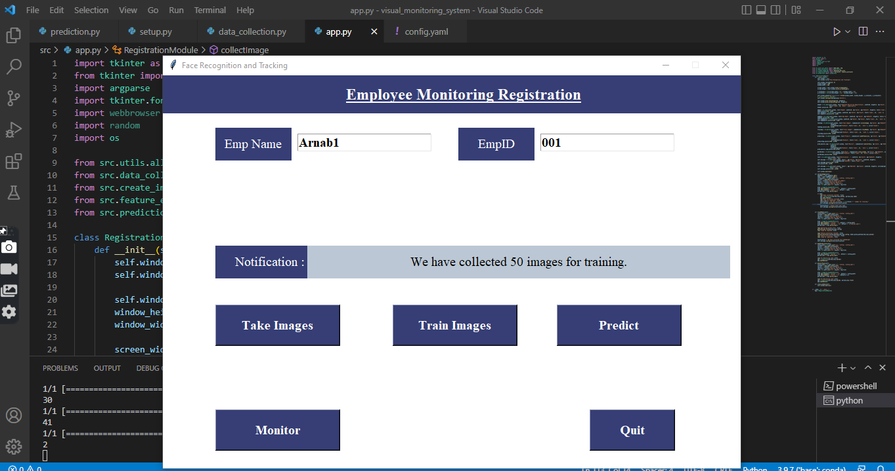
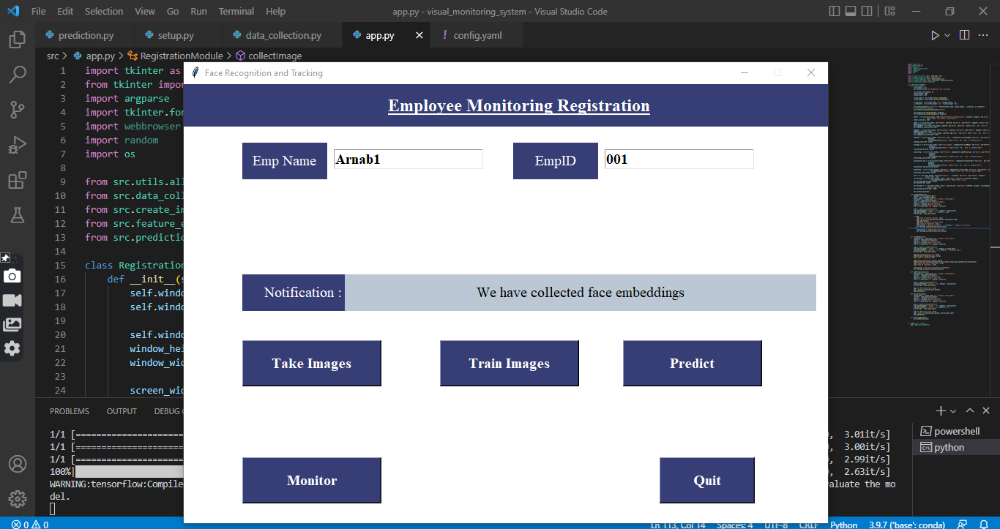
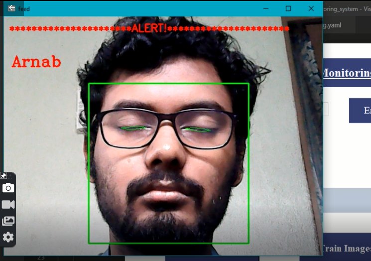

# Face recognition and Monitoring System

This is a Desktop based application which can recognize you and monitor you, wheather you are sleeping or not.
It is helpful for those students who can not concentrate on their studies and fall asleep during their study.
## Algorithm Used

Keras-Vggface
## Installation

* conda create --prefix ./env python==3.8 -y
* conda activate <<path_to_env_directory>>/env
* pip install -r requirements.txt

## Steps

### Take image through webcam (by default this application takes 50 images of you)

### Train Model (system collects all the face embeddings of all persons, present in your directory)

### Prediction or Monitor (In prediction, system only recognize you. In Monitor, it recognize you and monitor you

